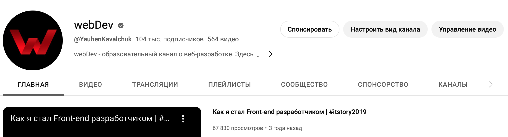
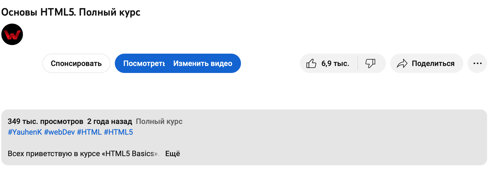

# Как получить доступ к закрытым видео?

Для того, что бы получить доступ к закрытым видео вам нужно оформить спонсорство на канале. Выбрать можно один из доступных уровней:
- **Student**
- **Junior**
- **Middle** 
- **Senior**

_P.S. внимательно ознакомьтесь с бонусами доступными для каждого уровня._

Кнопку "спонсировать" можно найти на главной странице канала:

Так же она есть под любым из видео:

Воспользоваться прямой ссылкой: [YouTube-спонсорство][sponsor]

Если вы **не видите** кнопку, значит данная функция **не доступна** в вашем регионе.
В этом случае можно воспользоваться [вариантом с криптой (пункты #3 и #4)][sponsoring].

[sponsor]: https://www.youtube.com/channel/UCE9ODjNIkOHrnSdkYWLfYhg/join
[sponsoring]: https://github.com/YauhenKavalchuk/youtube/blob/main/sponsoring.md
